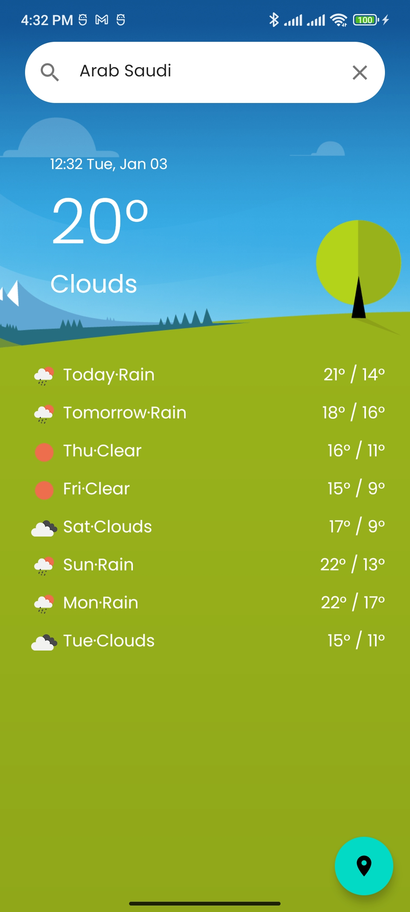

# Weather Clean Architecture 

A weather android app demonstrates Clean Architecture and is written in Kotlin.

## Introduction

I try to follow Clean Architecture guide recommended architecture for building robust, high-quality
apps.

  * User Interface built with [Jetpack Compose](https://developer.android.com/jetpack/compose)
  * A single-activity architecture
  * A **presentation layer** that contains a Compose screen (View) and a **ViewModel** per screen (or
  feature).
  * Reactive UIs using **Flow** and **Coroutines** for asynchronous operations.
  * A **data layer** with repositories and data sources (local using Room and a api service).
  * Dependency injection
    using [Hilt](https://developer.android.com/training/dependency-injection/hilt-android)

## Screenshot

